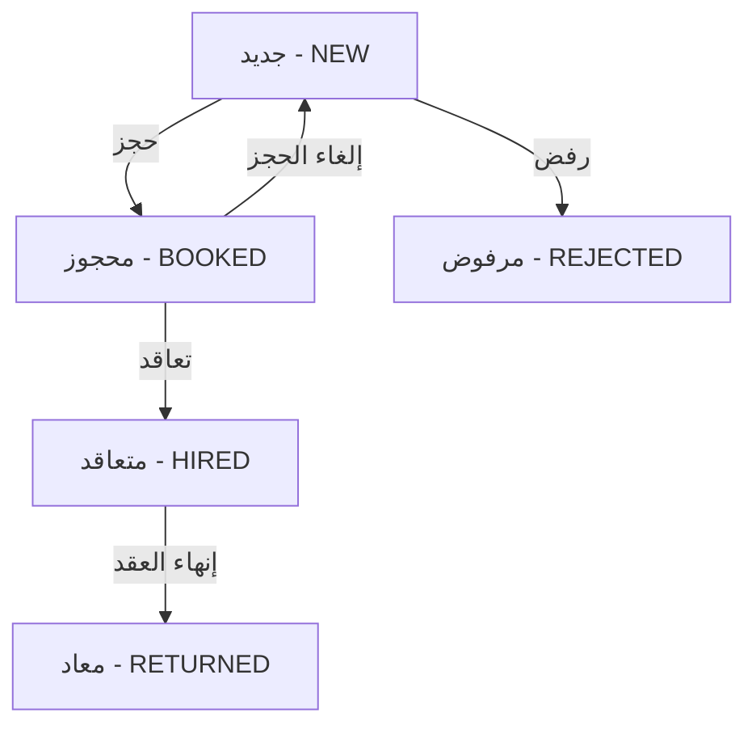

# ✅ نظام الحجوزات - تم الإصلاح والتكامل الكامل

## 🔧 المشكلة التي تم حلها

### الخطأ:
```
Error fetching bookings: TypeError: Cannot read properties of undefined (reading 'findMany')
    at GET (src\app\api\bookings\route.ts:16:39)
> 16 |     const bookings = await db.booking.findMany({
```

### السبب:
- ❌ نموذج `Booking` موجود في قاعدة البيانات
- ❌ لكن Prisma Client لم يكن محدثاً
- ❌ `db.booking` كان `undefined`

### الحل:
1. ✅ تحديث `schema.prisma` بنموذج Booking الكامل
2. ✅ سحب schema من قاعدة البيانات: `prisma db pull`
3. ✅ توليد Prisma Client: `prisma generate`
4. ✅ إعادة تشغيل السيرفر

---

## 📋 نموذج Booking في Schema

```prisma
model Booking {
  id             Int      @id @default(autoincrement())
  cvId           Int      @unique // Each CV can only have one booking
  identityNumber String   // رقم الهوية المطلوب عند الحجز
  notes          String?  // ملاحظات اختيارية
  bookedAt       DateTime @default(now())
  bookedById     Int

  cv       CV   @relation(fields: [cvId], references: [id], onDelete: Cascade)
  bookedBy User @relation("BookedCVs", fields: [bookedById], references: [id])

  @@map("bookings")
}
```

---

## 🎯 كيف يعمل نظام الحجوزات

### 1. **الحجز (Booking)**

#### من صفحة Dashboard الرئيسية (`/dashboard`):
```tsx
// عند الضغط على زر "حجز"
1. يظهر Modal يطلب:
   - رقم الهوية (مطلوب) ✅
   - ملاحظات (اختياري) ✅

2. يتم إرسال POST request إلى `/api/bookings`:
   {
     cvId: number,
     identityNumber: string,
     notes: string?
   }

3. يتم إنشاء حجز جديد:
   - تحفظ البيانات في جدول bookings
   - تتغير حالة السيرة إلى BOOKED
   - لا تظهر السيرة في صفحة Dashboard بعد ذلك ✅
```

#### API Endpoint - POST `/api/bookings`:
```typescript
// src/app/api/bookings/route.ts
export async function POST(request: NextRequest) {
  const { cvId, identityNumber, notes } = await request.json()
  
  // التحقق من أن السيرة غير محجوزة مسبقاً
  const existingCV = await db.cV.findUnique({
    where: { id: parseInt(cvId) },
    include: { booking: true }
  })
  
  if (existingCV.booking) {
    return NextResponse.json({ error: 'السيرة الذاتية محجوزة مسبقاً' })
  }
  
  // إنشاء الحجز
  const booking = await db.booking.create({
    data: {
      cvId: parseInt(cvId),
      identityNumber,        // ✅ رقم الهوية مطلوب
      notes: notes || null,  // ✅ ملاحظات اختيارية
      bookedById: decoded.userId
    }
  })
  
  // تحديث حالة السيرة إلى BOOKED
  await db.cV.update({
    where: { id: parseInt(cvId) },
    data: { status: 'BOOKED' }
  })
}
```

### 2. **عرض الحجوزات**

#### صفحة المحجوزات (`/dashboard/booked`):
```tsx
// يتم جلب جميع الحجوزات
GET /api/bookings

// الـ Response:
[
  {
    id: 1,
    cvId: 123,
    identityNumber: "123456789",  // رقم الهوية
    notes: "ملاحظات هامة",         // الملاحظات
    bookedAt: "2025-10-02T...",
    cv: {
      fullName: "اسم المرشح",
      position: "عاملة منزلية",
      nationality: "فلبينية",
      // ... باقي البيانات
    },
    bookedBy: {
      name: "اسم المستخدم",
      email: "user@example.com"
    }
  }
]
```

### 3. **التعاقد من الحجز**

#### في صفحة المحجوزات:
```tsx
// عند الضغط على زر "تعاقد"
1. يظهر Modal للتأكيد
2. يمكن تعديل رقم الهوية إذا لزم الأمر
3. عند التأكيد:
   - يتم إنشاء contract جديد
   - يتم حذف الحجز
   - تتغير حالة السيرة إلى HIRED
   - تظهر في صفحة التعاقدات
```

---

## 🔄 دورة حياة السيرة الذاتية



### الحالات (Status):
1. **NEW** - جديد (تظهر في Dashboard الرئيسية)
2. **BOOKED** - محجوز (تظهر في صفحة المحجوزات فقط) ✅
3. **HIRED** - متعاقد (تظهر في صفحة التعاقدات)
4. **RETURNED** - معاد (تظهر في صفحة المعادين)
5. **REJECTED** - مرفوض (مؤرشف)

---

## 🚫 الفلترة - عدم عرض المحجوزات في صفحات أخرى

### في Dashboard الرئيسية (`/dashboard/page.tsx`):
```typescript
const filterCVs = () => {
  // إخفاء السير المتعاقدة والمحجوزة
  let filtered = cvs.filter(cv => 
    cv.status !== CVStatus.HIRED &&   // المتعاقدة
    cv.status !== CVStatus.BOOKED     // المحجوزة ✅
  )
  // ... باقي الفلاتر
}
```

### في صفحة المحجوزات (`/dashboard/booked/page.tsx`):
```typescript
// تظهر فقط السير بحالة BOOKED
const fetchBookings = async () => {
  const response = await fetch('/api/bookings')
  const data = await response.json()
  // data تحتوي فقط على السير المحجوزة ✅
}
```

---

## 📊 البيانات المطلوبة عند الحجز

### ✅ رقم الهوية (مطلوب):
- يستخدم لتوثيق الحجز
- يمكن استخدامه لاحقاً في التعاقد
- يظهر في صفحة المحجوزات

### ✅ ملاحظات (اختياري):
- معلومات إضافية عن الحجز
- تاريخ المقابلة
- متطلبات خاصة
- أي ملاحظات أخرى

---

## 🎨 واجهة المستخدم

### Modal الحجز:
```tsx
<Modal title="حجز السيرة الذاتية">
  <Input
    label="رقم الهوية"
    required
    placeholder="أدخل رقم الهوية"
  />
  <Textarea
    label="ملاحظات (اختياري)"
    placeholder="أضف أي ملاحظات..."
  />
  <Button>تأكيد الحجز</Button>
</Modal>
```

### بطاقة الحجز في صفحة المحجوزات:
```tsx
<Card>
  <Header>
    <Avatar />
    <Name>{booking.cv.fullName}</Name>
    <Priority>{priority}</Priority>
  </Header>
  
  <Body>
    <Info>
      <Icon>User</Icon>
      رقم الهوية: {booking.identityNumber} ✅
    </Info>
    {booking.notes && (
      <Info>
        <Icon>Calendar</Icon>
        ملاحظات: {booking.notes} ✅
      </Info>
    )}
  </Body>
  
  <Footer>
    <Button>تعاقد</Button>
    <Button>عرض السيرة</Button>
  </Footer>
</Card>
```

---

## ✨ الخلاصة

### ✅ ما تم إنجازه:
1. ✅ إصلاح خطأ `db.booking.findMany`
2. ✅ نموذج Booking كامل في schema
3. ✅ API الحجوزات يعمل بشكل صحيح
4. ✅ رقم الهوية مطلوب عند الحجز
5. ✅ إمكانية إضافة ملاحظات
6. ✅ السير المحجوزة تظهر فقط في صفحة المحجوزات
7. ✅ لا تظهر في Dashboard الرئيسية أو أي صفحة أخرى

### 🎯 النتيجة:
**نظام حجوزات متكامل وفعّال!** 🎉

- السير الجديدة → Dashboard
- السير المحجوزة → صفحة المحجوزات (فقط) ✅
- السير المتعاقدة → صفحة التعاقدات
- كل شيء منظم ومفصول

---

**تم الانتهاء من نظام الحجوزات بالكامل!** 🚀✨

